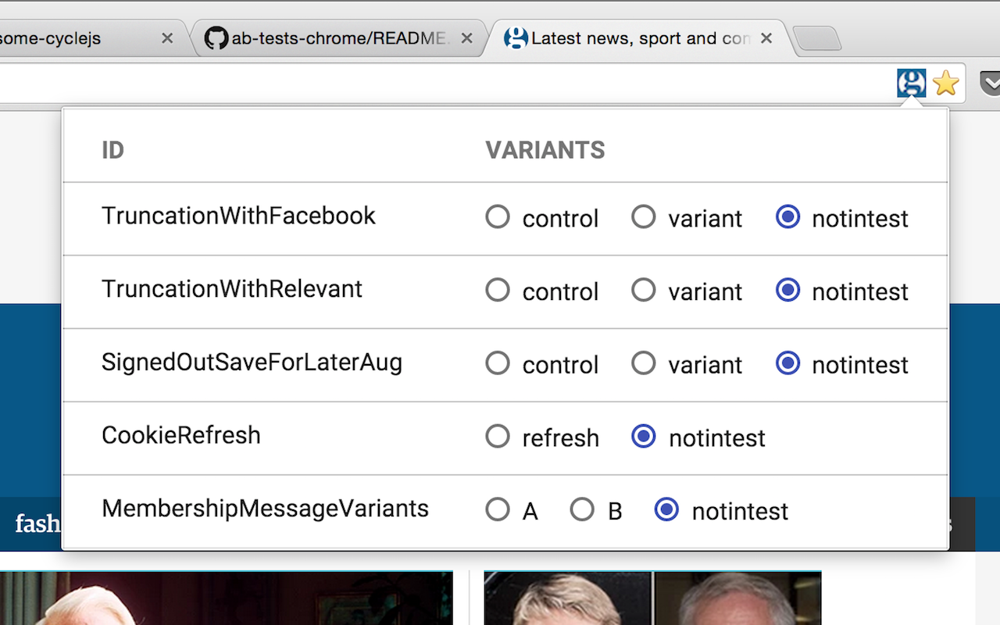

# Guardian A/B tests Chrome extension

Chrome extension to easily view and switch A/B tests on theguardian.com.

Written using RxJS, virtual-dom, ImmutableJS, Material Design Lite, and jspm.

https://chrome.google.com/webstore/detail/ab-tests/nehbenedinjacnhlkjbdneedibcagmno



## Testing

```
npm install
./node_modules/.bin/jspm install
```

## Release

```
./build.sh
./bundle.sh
# manually upload artifact
```
